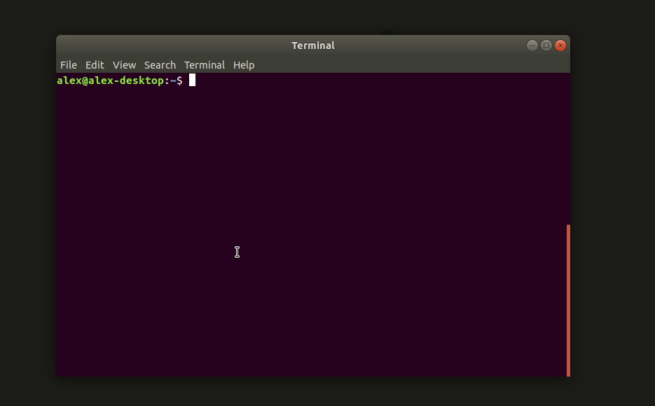

[](https://pypi.org/project/git-me-the-url)
[](https://github.com/amykyta3/git-me-the-url/actions?query=workflow%3Abuild+branch%3Amaster)

# Git me the URL!

A python package that translates references in a local git repository into
shareable URLs for popular Git hosting sites.

Currently supports:
* GitHub
* GitLab
* Bitbucket

To add your own URL translator, see this example project: https://github.com/amykyta3/gmtu-plugin-example

## Installing
Install from [PyPi](https://pypi.org/project/git-me-the-url) using pip:

    python3 -m pip install git-me-the-url

## Command line application

Use it for everyday link sharing with friends:



## Python API

Embed in your Python application:

```python
from gitmetheurl import GitMeTheURL

gmtu = GitMeTheURL()
url = gmtu.get_source_url("my_git_repo/my_file.txt")
print(url)
```
